# Non-Linear Control Architectures: LQR vs. Deep Reinforcement Learning


> **Research Abstract:** This project presents a comprehensive comparative study between **Classical Optimal Control (LQR)** and **Model-Free Deep Reinforcement Learning (DQN)** applied to non-linear unstable systems. It features a custom-built physics engine, a "first-principles" Neural Network implementation using raw NumPy, and an adversarial multi-agent simulation environment.

---

### 🎥 Simulation Demo
*Real-time stabilization and adversarial interaction (DQN Agent)*


---

## 📑 Table of Contents
1. [System Architecture](#-system-architecture)
2. [Mathematical Foundations](#-mathematical-foundations)
3. [Algorithmic Implementation](#-algorithmic-implementation)
4. [Adversarial Multi-Agent Mode](#-adversarial-multi-agent-mode)
5. [Installation & Reproduction](#-installation--reproduction)

---

## 🏗 System Architecture

The simulation is architected around a decoupled **Physics Engine** and **Controller Agent** pattern, allowing for the interchangeability of control strategies without altering the environment dynamics.

```mermaid
graph TD
    Env[Physics Environment] <-->|State Vector x, θ| Agent[Control Agent]
    Agent -->|Action u| Env
    subgraph Control Strategies
    LQR[LQR Regulator]
    DQN[Deep Q-Network]
    CustomNN[NumPy Neural Net]
    end
    Agent -.-> LQR
    Agent -.-> DQN
    Agent -.-> CustomNN

```



### State Space Representation

The system is modeled with 4 state variables:

* : Cart Position
* : Cart Velocity
* : Pole Angle (0 = Upright)
* : Pole Angular Velocity

---

## 🧮 Mathematical Foundations

### 1. Dynamics & Linearization

The inverted pendulum is a highly non-linear system. For the LQR controller, the system dynamics are linearized around the vertical equilibrium point using the Jacobian matrix:

$$ \dot{x} = Ax + Bu $$

Where  (System Matrix) and  (Input Matrix) define the state evolution.

### 2. Optimal Control (LQR)

The Linear Quadratic Regulator minimizes the infinite horizon quadratic cost function:

$$ J = \int_{0}^{\infty} (x^T Q x + u^T R u) dt $$

The optimal control law is derived as , where  is the state-feedback gain matrix obtained by solving the **Algebraic Riccati Equation**.

### 3. Deep Q-Learning (Bellman Equation)

For the Reinforcement Learning agent, we approximate the Q-value function using a Deep Neural Network, optimizing the Bellman equation:

$$ Q(s, a) = r + \gamma \max_{a'} Q(s', a') $$

---

## 🧠 Algorithmic Implementation

### A. Classical Control (The Benchmark)

* **Module:** `supervised-learning/pendulum_lqr_control.py`
* **Logic:** Uses the `control` library to compute the optimal gain matrix .
* **Role:** Acts as the "Expert System" to generate high-quality synthetic training data (State -> Action pairs) for supervised learning models.

### B. Deep Reinforcement Learning (DQN)

* **Module:** `reinforcement-learning/pendulum_training.py`
* **Architecture:** Multi-Layer Perceptron (MLP) with Replay Buffer.
* **Optimization:** Uses **Experience Replay** to break correlation between consecutive samples and **Target Networks** to stabilize training.
* **Exploration:** Implements Adaptive -greedy strategy.

### C. Custom Neural Engine (First-Principles Approach)

* **Module:** `supervised-learning/pendulum_supervised_math.py`
* **Highlight:** This module implements a Neural Network **without any DL frameworks (No TensorFlow/PyTorch)**.
* **Core Concepts Demonstrated:**
* Forward Propagation (Matrix Multiplications).
* Loss Calculation (MSE).
* Backpropagation (Chain Rule & Gradient Descent manually computed).
* Weight Updating ().


---

## ⚔️ Adversarial Multi-Agent Mode

A unique feature of this research is the **Competitive Simulation (`pendulum_training_fight.py`)**.

* **Scenario:** Two agents operate in the same environment.
* **Dynamics:** While trying to balance their own pendulum, agents can exert disturbance forces on the opponent based on calculated proximity and energy levels.
* **Goal:** Tests the robustness of the control policy against stochastic external disturbances.

---

## 🚀 Installation & Reproduction

### Prerequisites

The project relies on scientific computing and control libraries.

```bash
pip install numpy tensorflow scipy matplotlib control pandas scikit-learn

```

### Execution Guide

**1. Generate Baseline Data (LQR):**

```bash
python supervised-learning/pendulum_lqr_control.py
# Outputs: pendulum_data.csv

```

**2. Train the Model-Free Agent (RL):**

```bash
python reinforcement-learning/pendulum_training.py

```

**3. Run the "Math-Based" Custom Network:**

```bash
python supervised-learning/pendulum_supervised_math.py

```

**4. Start the Battle Arena:**

```bash
python reinforcement-learning/pendulum_training_fight.py

```

---

## ⚖️ License

This project is open-source and available under the **MIT License**.
